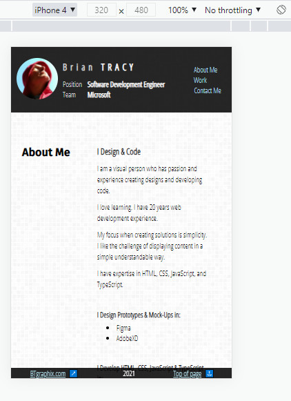
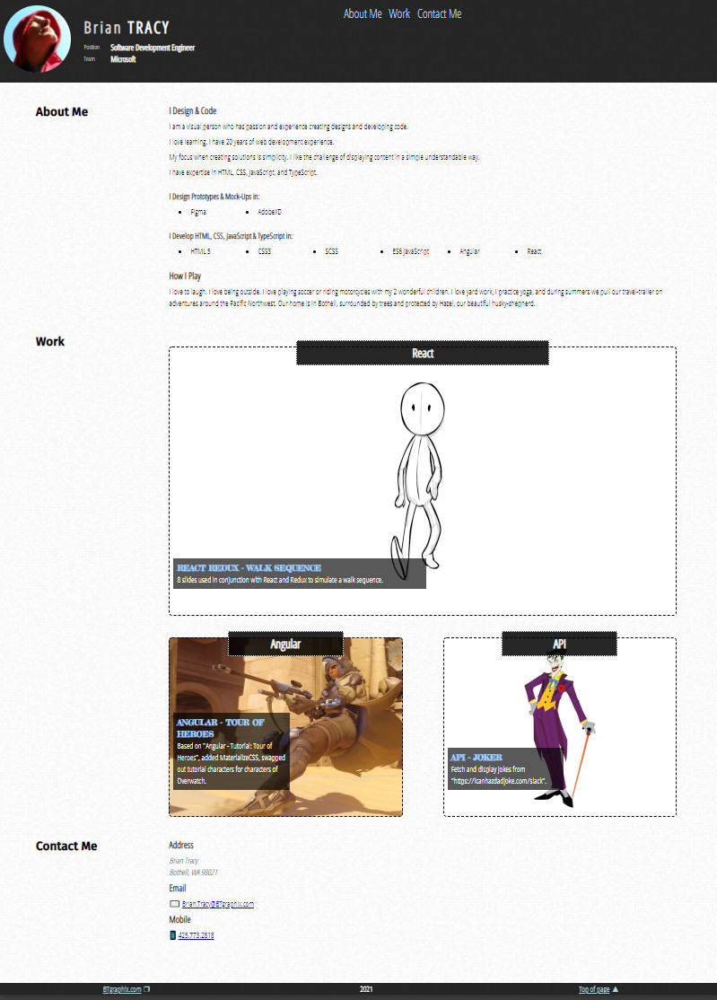

# Portfolio by Brian Tracy

This portfolio page is work in progress that will grow as I progress through the UW Code Bootcamp.

## Satisfied Acceptance Criteria

```
GIVEN I need to sample a potential employee's previous work

WHEN I load their portfolio
THEN I am presented with the developer's name, a recent photo or avatar, and links to sections about them, their work, and how to contact them

WHEN I click one of the links in the navigation
THEN the UI scrolls to the corresponding section

WHEN I click on the link to the section about their work
THEN the UI scrolls to a section with titled images of the developer's applications

WHEN I am presented with the developer's first application
THEN that application's image should be larger in size than the others

WHEN I click on the images of the applications
THEN I am taken to that deployed application

WHEN I resize the page or view the site on various screens and devices
THEN I am presented with a responsive layout that adapts to my viewport
```

## Advanced CSS

This site applies the core CSS skills learned: flexbox, media queries and CSS variables.

### Pseudo elements

Pseudo elements are used to display appropriate symbol images next to the following anchors elements: email, phone number, external sites, and top of page

### Responsive Design

This portfolio supports responsive design from mobile, tablet, to large desktop screens.

#### Breakpoints

This design uses the following media query breakpoints: 1028px, 768px, 480px

#### Mobile View

CSS flexbox & media queries are used to support smaller tablet & mobile screens.



#### Desktop View

Main content area is capped at 1600px wide and centered for nice desktop reading.



## JavaScript

JavaScript is used to dynamically display current year in the footer

JavaScript is also used to satisfy the acceptance criteria to click the work example image to open the deployed example. I liked having the example images as backgrounds, so I leveraged "onclick" on the image container to open the deployed example.

## Deployed Application

[https://bravotango.github.io/portfolio/](https://bravotango.github.io/portfolio/)
